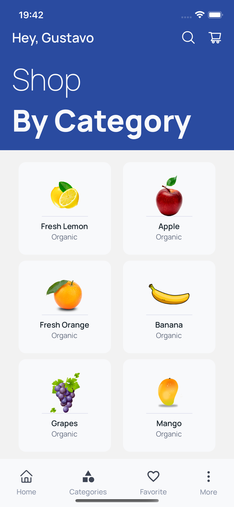
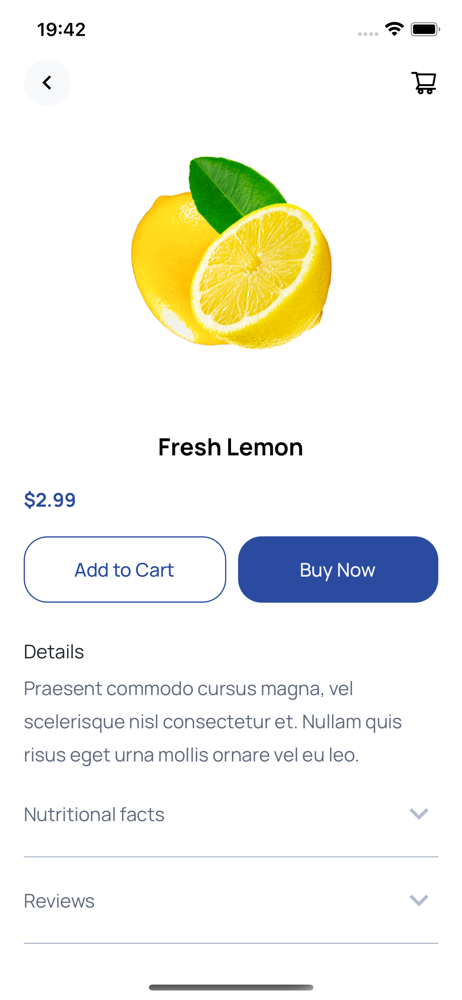

<div align="center">
  <h1>📱 React Naitve Animated Element Transition 📱</h1>
  <p>
    
     <a href="https://www.linkedin.com/in/gustavo-castilho-914a621b4/" target="_blank" rel="noopener noreferrer">
      
    </a>
    </p>
</div>

<h2>Demo 🎥</h2>
https://github.com/GusttavoCastilho/React-Native-Animated-Elements/assets/67564443/57503cbe-7971-424a-b4f7-db8125e3634b

<h2>Prints 📸</h2>
<div align="center" style="display: flex; flex-direction: row;gap:20px;">
  
  
</div>

<h2>Technologies 🚀</h2>
<li><a href="https://reactnative.dev/">React Native</a></li>
<li><a href="https://www.typescriptlang.org/">Typescript</a></li>
<li><a href="https://docs.swmansion.com/react-native-reanimated">React Native Reanimated</a></li>

<h2>Installing and running the project 🎲</h2>

```bash
# Clone this repository
$ git clone https://github.com/GusttavoCastilho/React-Native-Animated-Elements

# Access the project folder in your terminal
$ cd React-Native-Animated-Elements

# Install the dependencies
$ yarn install

# Start server
$ yarn server

# Start Metro Bundle
$ yarn start

# Finally, run:
$ yarn android # if your device is android
$ yarn ios # if your device is ios
```

<h2>How to contribute? 😍</h2>

**Fork this repository**

```bash
# Clone your fork
$ git clone your-fork-url && cd React-Native-Animated-Elements

# Create a branch with your feature or bug fix
$ git checkout -b my-branch

# Commit your changes
$ git commit -m 'my changes'

# Push your branch
$ git push origin my-branch
```

Delete your branch, if you want, when your pull request merge.

<h2>📝 License</h2>

This project is licensed under the MIT License - see the [LICENSE](LICENSE) file for details.

<hr>
<p align=center>Made with 💜 by <a href="https://www.linkedin.com/in/gustavo-castilho-914a621b4/">Gustavo Castilho</a><p>
